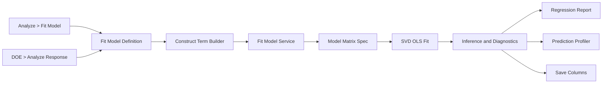

# Fit Model 回归分析核心闭环增强设计

**日期：** 2026-09-02

**状态：** 已批准

**Issues：** #83、#91

**基线设计：** `docs/superpowers/specs/2026-09-01-issue-83-fit-model-regression-design.md`

## 1. 背景与决策

Issue #83 的首期 Fit Model 已完成连续响应、多元 OLS、连续主效应、两因子交互、
交互中心化、核心报告、两张诊断图、Remove & Refit、一步 Undo，以及项目保存和
恢复。本设计不重写该基线，而是在现有 `FitModelItem -> Tauri IPC -> Rust OLS ->
React Report` 链路上完成 #83 的预测闭环和 #91 的 DOE 回归增强。

本轮采用“渐进扩展现有 Fit Model”方案，不创建第二套 DOE Regression 引擎，也
不重写通用 Modeling Engine。目标是在控制协议迁移和统计风险的前提下，同时关闭
#83 和 #91 的核心范围。

## 2. 目标

本轮完成以下能力：

1. 提供 `Full Factorial`、`Factorial to Degree`、`Response Surface` 三种
   Construct Model Effects；
2. 支持二阶至 k 阶连续因子交互，以及连续因子的平方项；
3. 为模型项设置 256 项硬上限，并在前后端执行相同约束；
4. 显示包含实际系数和中心值的完整拟合方程；
5. 提供均值置信区间和个体预测区间；
6. 提供可交互 Prediction Profiler；
7. 提供 Lack of Fit / Pure Error、VIF、Studentized Residual、Leverage、
   Cook's D 和残差 Q-Q 图；
8. 将核心预测和诊断结果原子写回源表，并通过现有 change-set/history 撤销；
9. 保留 Analyze > Fit Model 通用入口，并定义 DOE > Analyze Response 快捷入口；
10. 旧 Fit Model 项目保持可加载、可重算，既有模型语义不得改变。

## 3. 非目标

本轮不实现：

- nominal/ordinal predictor coding、参考水平和分类变量交互；
- Logistic、GLM、多响应、权重、offset 或无截距模型；
- Stepwise、自动变量选择、FDR 和自动按 p-value 删除；
- inverse prediction、desirability、目标优化和多响应联合优化；
- Durbin-Watson、Breusch-Pagan、Shapiro-Wilk 等扩展检验；
- 自动删除、隐藏或修改异常观测；
- 任意幂次多项式；P0 的 power term 只允许指数 2；
- 在本轮创建完整 DOE 设计生成器。若 DOE 模块尚不存在，只交付可供未来 DOE
  结果页调用的预填入口契约和集成测试夹具。

## 4. 总体架构



维持“定义持久化、结果可重算”的现有边界：

- `FitModelItem` 保存模型定义和 construct 元数据，不保存大型逐行结果；
- Rust 使用全量 complete-case 数据生成权威拟合、推断和诊断；
- 报告 hook 继续使用 dataset generation、configuration key 和 request token
  防止旧响应覆盖新结果；
- Profiler 使用当前拟合响应内的紧凑快照在前端计算，不在拖动时重新读取 DuckDB；
- Save Columns 使用独立 Tauri mutation command，重新验证 generation 后原子写列。

## 5. 持久化模型与兼容性

### 5.1 Construct 元数据

新增可选 construct：

```ts
type FitModelConstruct =
  | { kind: "manual" }
  | { kind: "fullFactorial" }
  | { kind: "factorialToDegree"; degree: number }
  | { kind: "responseSurface" };
```

`FitModelItem.construct` 缺失时按 `{ kind: "manual" }` 迁移。construct 只说明
模型如何生成和如何在 UI 中展示；Rust 计算始终以显式 `terms` 为权威输入，
不得根据 construct 在后端隐式补项。

### 5.2 Term 协议

扩展 term 判别联合：

```ts
type FitModelTerm =
  | { kind: "main"; columnNames: [string] }
  | { kind: "interaction"; columnNames: string[] }
  | { kind: "power"; columnNames: [string]; exponent: 2 };
```

这是对现有 JSON/IPC 协议的向后兼容扩展，不提高 archive schema version：旧的 main
和 interaction payload 仍是新联合的合法子集；Rust 增加 `Power` enum variant 并在
resolver 中严格限制 exponent 为 2。TypeScript 使用 tuple 约束帮助新代码，archive
loader 仍从 `unknown` 逐字段解析，不能依赖 compile-time tuple 保证。

约束：

- interaction arity 为 2 到 k，列名不得重复；
- interaction identity 按 canonical column tuple 定义，`A*B*C` 的排列均视为同项；
- strong hierarchy 要求 interaction 引用的所有 main effects 存在；
- power term 要求相同列的 main effect 存在；
- response 不得出现在任何 term 中；
- response 和 predictor 在本轮都必须为 continuous；
- 截距固定存在，不计入 `terms`，但计入参数数 p；
- 单个模型最多 256 个 persisted terms，即最多 257 个含截距参数；
- 实时请求遇到重复、超限或非法 term 必须拒绝，不得静默修复；
- 项目加载可规范化旧的二因子 interaction，但非法新协议必须写入
  `loadIssue.code="invalidPersistedDefinition"` 并隔离为 unavailable，
  不得导致整个项目打开失败。

运行时创建和 IPC 使用 `AppError::InvalidParam` 拒绝非法定义；archive load 使用
`FitModelLoadIssue` 保留损坏文档供用户识别；dataset generation 或引用列失效属于
stale/unavailable 数据源状态。这三类状态不得互相转换或共用模糊错误文案。

现有 `{ kind: "main" }` 和二因子 `{ kind: "interaction" }` JSON 无需迁移即可加载。
既有 `centeringMethod="mean"` 继续保持原语义：main feature 使用原始值，interaction
中的每个参与值使用 complete-case 均值中心化。power feature 在 `mean` 时使用
`(X - mean(X))^2`，在 `none` 时使用 `X^2`。因此旧模型的系数和拟合值不变。

## 6. Construct Model Effects

### 6.1 Full Factorial

对 k 个已选择连续因子生成全部 1 到 k 阶项：

$$
\sum_{r=1}^{k}{k \choose r}=2^k-1
$$

一阶项为 main effects，二阶及以上为 interaction。生成顺序固定为 main effects，
然后按阶数升序和 canonical tuple 字典序排列。若项数超过 256，前端禁止应用，
后端仍执行相同上限校验。

### 6.2 Factorial to Degree

生成全部 1 到 d 阶项，其中 `1 <= d <= k`：

$$
\sum_{r=1}^{d}{k \choose r}
$$

UI 使用整数 stepper 选择 d。当前 Degree 1/2 行为映射到该 construct，项目读取后
不要求反向推断旧模型最初是否由宏生成。

### 6.3 Response Surface

对 k 个连续因子生成标准二阶响应面：

$$
Y=\beta_0+\sum_i\beta_iX_i+\sum_i\beta_{ii}X_i^2+
\sum_{i<j}\beta_{ij}X_iX_j+\varepsilon
$$

terms 包含全部 main、全部 two-way interaction 和全部 exponent-2 power，项数为
`2k + k(k-1)/2`。默认 `centeringMethod="mean"`；main feature 保持原始尺度，
interaction 与 power derived features 使用同一组 complete-case 中心值。由于完整
二阶模型包含 main effects，该参数化与全因子中心化具有相同拟合空间，并保持旧的
centering contract 向后兼容。

### 6.4 可计算性提示

前端在不读取全量数据的情况下显示 term/parameter 数和 256 上限。正式拟合时：

- `n < p` 返回 `insufficientRows`；
- `rank < p` 返回 `rankDeficient`；
- `n = p` 返回 fitted + `saturatedModel`，但推断和区间不可估；
- 不因样本不足丢弃已保存定义。

## 7. Rust 模型矩阵与拟合快照

`ResolvedTerm`、term resolver 和 `ModelMatrixSpec` 扩展为任意阶 interaction 与
exponent-2 power。feature 顺序必须与 resolved terms 完全一致：

```text
[Intercept, main..., interaction by degree..., power...]
```

交互 feature 为参与列原始值或中心化值的乘积。power feature 为原始值或中心化值
的平方。中心值只基于最终 complete-case rows 计算，并随结果结构化返回。

现有 SVD rank 和 coefficient solve 保持不变。新增紧凑拟合快照：

- coefficients；
- 可选 covariance matrix；
- MSE 和 error degrees of freedom；
- resolved terms、centers 和 centering method；
- 每个 predictor 的 complete-case min、max、mean；
- confidence level。

TS/Rust wire shape 冻结为：

```ts
interface FitModelSnapshot {
  coefficientTermIds: string[];
  coefficients: number[];
  covariance: number[][] | null;
  meanSquareError: number | null;
  errorDegreesOfFreedom: number;
  confidenceLevel: 0.95;
  terms: FitModelResolvedTerm[];
  centering: FitModelCentering;
  predictorRanges: Array<{
    columnName: string;
    minimum: number;
    maximum: number;
    mean: number;
  }>;
}
```

`coefficientTermIds[0]` 固定为 `Intercept`，其余顺序与 resolved terms 一致。
`covariance` 是 `MSE * (X^T X)^-1` 的系数协方差矩阵，行列顺序与
`coefficientTermIds` 一致；不可推断时为 `null`。矩阵必须是方阵并在序列化前验证
全部元素有限。P0 的 confidence level 固定为 0.95，不进入 `FitModelItem`，也不在
UI 中提供编辑；现有 request 字段保留并只接受 0.95，为未来可配置化保留协议位置。

协方差不存在时仍允许点预测，但置信区间、预测区间和依赖 MSE 的诊断返回 `null`。
不得序列化 NaN 或 Infinity。

## 8. 预测与区间

对输入点 $x_0$ 按 `ModelMatrixSpec` 构造 feature vector $z_0$：

$$
\hat y_0=z_0^T\hat\beta
$$

均值响应标准误与个体预测标准误分别为：

$$
SE_{mean}=\sqrt{MSE\,z_0^T(X^TX)^{-1}z_0}
$$

$$
SE_{pred}=\sqrt{MSE\,(1+z_0^T(X^TX)^{-1}z_0)}
$$

使用 error df 对应的双侧 t critical 生成默认 95% Mean CI 和 Prediction Interval。
前端预测内核只消费 Rust 返回的拟合快照，并与 Rust fixture 使用相同 oracle 校验。
输入超出任一训练 min/max 时允许外推，但必须返回并显示 extrapolation warning。
这些公式冻结为同方差、无权重 OLS；robust covariance 和 weighted regression 属于
非目标。covariance 缺失、MSE 为零/不可用、error df 为零或矩阵非有限时，点预测
仍可用，两个区间均返回 `null` 和 `inferenceNotEstimable`。

## 9. 工程诊断

### 9.1 Lack of Fit 与 Pure Error

使用所有 predictor 原始值的精确 tuple 对 complete-case rows 分组，比较前只把
`-0.0` 规范化为 `0.0`。不使用 epsilon 或显示格式分箱，避免把相近但不同的设计点
错误合并；导入后仅存在近似相等值时 UI 说明没有精确 replicate。只有至少一个 tuple
含重复观测时才可估计 pure error：

$$
SS_{PE}=\sum_g\sum_{i\in g}(y_i-\bar y_g)^2,
\quad df_{PE}=n-G
$$

$$
SS_{LOF}=SSE-SS_{PE},
\quad df_{LOF}=G-p
$$

仅当 `dfPE > 0`、`dfLOF > 0` 且 `MSPE > 0` 时计算 LOF F 和 p-value。否则显示
`Not estimable` 和稳定 reason code；浮点舍入造成的极小负 `SSLOF` 按现有 SSE
容差规则截断，超过容差则返回统计错误。

### 9.2 VIF

对除截距外的设计矩阵 feature 计算 VIF。常量 feature 或辅助回归不满秩时返回
`null` 并附 reason code，不输出 Infinity。VIF 按 resolved term 展示，不宣称为
原始因子级 generalized VIF。UI 标题使用 `Feature VIF`，避免把高阶 feature 的
共线性解释成原始因子级结论。

### 9.3 逐行诊断

全量拟合计算：

- fitted、residual；
- leverage $h_{ii}$；
- internally Studentized Residual；
- Cook's D；
- 当前行的 Mean CI 和 Prediction Interval。

报告 IPC 继续遵守 8,000 行确定性采样预算；Save Columns 在 Rust 内部对全量有效行
计算并写回，不依赖采样 payload。

默认提示阈值：

- `abs(studentizedResidual) > 2` 为 warning，`> 3` 为 severe；
- `leverage > 2p/n` 为 high leverage；
- `cooksDistance > 4/n` 为 influential。

阈值是工程筛查 heuristic，只控制标记，不构成正式异常值检验，也不自动更改模型
或数据。perfect fit、MSE 为零或 error df 为零时 Studentized Residual 和 Cook's D
返回 `null`；leverage、fitted 和 residual 在几何上可计算时保留。

### 9.4 残差 Q-Q 图

对有限的 Studentized Residual 排序，使用稳定 normal quantile 位置生成理论分位数。
图表显示点和参考线；不可推断或有效点不足时显示结构化空状态。

### 9.5 诊断结果契约

```ts
type FitModelInferenceReason =
  | "noReplicates"
  | "lackOfFitDegreesOfFreedomZero"
  | "pureErrorZero"
  | "inferenceNotEstimable"
  | "constantFeature"
  | "auxiliaryRankDeficient"
  | "insufficientDiagnosticRows";

interface FitModelRowDiagnostic {
  rowIndex: number;
  observed: number;
  fitted: number;
  residual: number;
  studentizedResidual: number | null;
  leverage: number | null;
  cooksDistance: number | null;
  meanConfidenceLower: number | null;
  meanConfidenceUpper: number | null;
  predictionLower: number | null;
  predictionUpper: number | null;
  flags: Array<"residualWarning" | "residualSevere" | "highLeverage" | "influential">;
}
```

LOF result 包含 Model/Pure Error/Lack of Fit 的 SS、df、MS、F、p-value 及可选 reason；
VIF row 包含 `termId`、`termLabel`、`value` 和可选 reason；Q-Q row 包含
`rowIndex`、`theoreticalQuantile`、`studentizedResidual`。逐行结果带
`rowsSampled` 和 `sourceRowCount`，使 UI 不会把采样表误称为全量表。

## 10. 报告与交互设计

Fit Model 页面维持垂直可滚动、disclosure section 风格，不创建卡片嵌套。顺序为：

1. Model Specification；
2. Effect Summary；
3. Summary of Fit；
4. Analysis of Variance；
5. Lack of Fit；
6. Parameter Estimates；
7. Actual by Predicted；
8. Residual by Predicted；
9. Residual Q-Q；
10. Row Diagnostics；
11. Prediction Profiler；
12. Warnings。

Model Specification 显示 construct、response、predictors、完整 terms、有效样本数和
`termCount / 256`。数据或定义变化时旧结果标记 stale，直到新结果成功。

拟合方程必须显示数值系数和实际 feature basis，例如：

$$
\hat Y=12.31+1.84X_1-0.27(X_2-20)^2+0.63(X_1-50)(X_2-20)
$$

Parameter Estimates 增加 Lower/Upper Confidence Limit；VIF 可作为同表列展示。
Row Diagnostics 显示原始 row index、预测值、残差、Studentized Residual、Leverage、
Cook's D 和阈值标记，并支持按标记筛选，不提供自动删除。

## 11. Prediction Profiler

每个 predictor 使用固定宽度 profiler column：剖面图、滑块、数值输入和训练范围。
其他 predictor 固定在当前输入值，仅扫描当前列。顶部持续显示：

- Predicted Mean；
- 95% Mean Confidence Interval；
- 95% Individual Prediction Interval；
- extrapolation 或 not-estimable 状态。

初始输入为 complete-case mean。滑块范围为训练 min/max；数值输入允许超范围值。
滑块和输入必须双向同步，拖动只触发前端纯函数计算。Profiler 不保存到
`FitModelItem`；重新打开分析时恢复训练均值，避免把探索状态误认为模型定义。

## 12. Save Columns

新增 `save_fit_model_columns` Tauri command，command 委托 `FitModelService`，service
复用 fit definition 和全量诊断计算，并调用 DuckDB mutation 层原子新增列。

```ts
type FitModelSavedMetric =
  | "predicted"
  | "residual"
  | "studentizedResidual"
  | "leverage"
  | "cooksDistance"
  | "meanConfidenceLower"
  | "meanConfidenceUpper"
  | "predictionLower"
  | "predictionUpper";

interface SaveFitModelColumnsRequest {
  datasetId: string;
  expectedGeneration: number;
  modelName: string;
  responseColumn: string;
  terms: FitModelTerm[];
  centeringMethod: FitModelCenteringMethod;
  confidenceLevel: 0.95;
  metrics: FitModelSavedMetric[];
}

interface SaveFitModelColumnsResult {
  changeSetId: string;
  generation: number;
  columns: Array<{ metric: FitModelSavedMetric; columnName: string }>;
}
```

可保存 9 类结果：

1. Predicted；
2. Residual；
3. Studentized Residual；
4. Leverage；
5. Cook's D；
6. Mean CI Lower；
7. Mean CI Upper；
8. Prediction Interval Lower；
9. Prediction Interval Upper。

默认选择前 5 类。无效或被 complete-case 排除的源行写 `NULL`。列名前缀由 Fit
Model 显示名清理后生成；所有候选列名先与 `_meta_columns` 比较，冲突时为整组列
追加最小可用稳定序号，禁止覆盖现有列。

UI 对当前拟合中不可估计的 metric 禁用选择并显示 reason。后端不信任 UI：请求
包含任一全局不可估计 metric 时返回 `AppError::InvalidParam`，且不创建任何列；
可估计 metric 对 complete-case 排除行仍按规定写 `NULL`。

写入前必须验证 expected generation，整个新增列和值写入在单一事务中完成；成功后
generation 递增一次，返回 change-set ID 和最终列名。Workspace 把该 change set
记录为一次全局 history 操作，Undo 必须原子移除整组列。

## 13. 构建模型对话框

将当前 Degree 1 / Degree 2 按钮替换为 construct segmented control：

- Full Factorial；
- Factorial to Degree；
- Response Surface。

Factorial to Degree 显示 `1..k` 整数 stepper。选择 construct 后显示 term preview、
参数数和 256 上限。高阶交互不铺成按钮矩阵，统一在可搜索 term list 中查看和删除。

响应和 predictor 继续只允许 continuous。若 term 数超限，禁用 Create 并说明计算式；
前端无法预知 complete-case n，因此不伪造 residual df。正式拟合返回样本不足时保留
分析定义，并在报告解释需要减少 terms 或增加有效试验行。

## 14. 双入口与 DOE 集成契约

保留 Analyze > Fit Model 通用入口。新增可复用的预填请求：

```ts
interface FitModelPrefill {
  sourceDatasetId: string;
  response: FieldRef;
  predictors: FieldRef[];
  construct: FitModelConstruct;
}
```

未来 DOE 结果页的 `Analyze Response` 调用该入口：

- 自动传入 DOE 数据集、所选响应和设计因子；
- factorial design 推荐 `fullFactorial` 或已知设计阶数对应的
  `factorialToDegree`；
- response surface design 推荐 `responseSurface`；
- 打开普通 Fit Model dialog 供用户确认，不绕过校验或自动运行。

当前仓库没有独立 DOE 模块。本轮先让 Workspace 接受 `FitModelPrefill` 并以 fixture
验证预填行为；只有 DOE 结果页已存在时才增加实际按钮。不得为了该按钮在本轮创建
DOE 设计生成器。

## 15. 错误、并发与安全

- 所有新 command 返回 `Result<T, AppError>`，非测试 Rust 不使用 `unwrap()` 或
  `expect()`；
- 列名必须先通过元数据校验，再使用现有 identifier quoting helper；
- Fit、Profiler 和 Save Columns 均使用 canonical terms；
- Save Columns 获取 mutation permit，并在数据库锁内重新检查 generation；
- 保存期间源数据变化返回 stale-generation 错误，不写入部分列；
- stale report 可以继续查看，但禁用 Save Columns，直到当前 generation 拟合成功；
- profiler 输入必须是有限数值，非法输入保留上次有效预测并显示字段错误；
- 超出训练范围是 warning，不是请求错误；
- expected degeneracy 使用稳定 reason code，系统故障使用 `AppError`；
- 新增 reason/warning code 在 en、zh-CN、zh-TW、vi 四个 locale 完整覆盖。

稳定统计 reason code 为第 9.5 节的 `FitModelInferenceReason`；沿用既有 result reason
`insufficientRows`、`rankDeficient` 和 warnings `saturatedModel`、`constantResponse`、
`perfectFit`、`illConditioned`。非法定义、非法 metric、stale generation、数据库失败
不进入统计 reason code，分别映射 `InvalidParam`、`InvalidParam`、`InvalidParam` 和
`Database`。

## 16. 性能边界

- terms 硬上限 256；
- 报告逐行 payload 和 Q-Q 点各不超过 8,000；
- 全量统计和 Save Columns 不使用采样；
- profiler 每个 predictor 默认生成不超过 101 个扫描点；
- covariance 为最多 257 x 257 的紧凑数值矩阵，只在可推断时返回；
- construct term count 在生成组合前使用安全组合数计算，禁止先构造超大数组；
- 高阶 feature 按行计算，不在 DuckDB 中拼接用户输入 SQL 表达式；
- 256 项上限下的性能验收需要固定 fixture 和可重复预算，不以开发机单次耗时作为
  唯一正确性标准。

## 17. 测试策略

### 17.1 TypeScript 合同与状态

- 三种 construct 的精确 term 集合、顺序和组合数；
- 256 边界、溢出前拒绝和 strong hierarchy；
- interaction tuple identity、power identity 和旧 JSON 兼容；
- dialog construct 切换、degree stepper、term preview 和 prefill；
- 数值方程格式化；
- profiler point/Mean CI/Prediction Interval 与 Rust oracle 一致；
- extrapolation、不可推断和非法输入；
- report sections、阈值标记和 Save Columns 选择状态；
- store/project archive 对 construct 和新 terms 的 round trip。

### 17.2 Rust 数值测试

- 3 因子 Full Factorial 的 7 个 terms；
- degree 1、2、3 的模型矩阵；
- 二因子标准 response surface；
- centered/raw high-order interaction 和 power；
- prediction、Mean CI、Prediction Interval 的独立 Python/R oracle；
- replicated settings 的 pure error 和 LOF；
- 无 replicate、zero pure error 和 saturated model；
- VIF、leverage、Studentized Residual 和 Cook's D oracle；
- Q-Q quantile 输入；
- 256 term、insufficient rows、rank deficient 和 non-finite 防护。

### 17.3 Save Columns 与 UI 验收

- generation race 不产生列；
- 任一新增/写值失败时事务完全回滚；
- 重名时整组稳定改名；
- excluded rows 写 NULL；
- Undo 一次移除整组 9 列并恢复 generation；
- Analyze 通用入口和 DOE prefill 入口生成相同 canonical definition；
- desktop 和窄视口中 dialog、报告、Profiler 无重叠；
- profiler 滑块、键盘和数值输入可访问；
- Tauri 中完成创建、拟合、诊断、保存列、撤销和 save/reopen。

## 18. 分阶段交付

### 阶段 0：恢复构建基线

修复当前与 Fit Model 无关的 `TabulateView.existingDatasetNames` TypeScript 调用错误，
建立 `npm run build` 可通过的前置条件。该修复必须独立提交，不与回归增强混合。

### 阶段 1：协议与 Construct

扩展 TS/Rust terms、construct 元数据、规范化、strong hierarchy、256 限制、项目兼容
和构建模型对话框。

### 阶段 2：模型矩阵与拟合快照

实现高阶 interaction、power、中心化、predictor ranges、covariance snapshot 和数值
拟合方程。

### 阶段 3：推断与工程诊断

实现 prediction intervals、LOF/Pure Error、VIF、leverage、Studentized Residual、
Cook's D 和 Q-Q 数据。

### 阶段 4：报告

接入 Model Specification、完整方程、参数置信区间、LOF、VIF、Row Diagnostics 和
Residual Q-Q。

### 阶段 5：Prediction Profiler

实现前端预测内核、剖面图、滑块/数值输入、区间和外推提示。

### 阶段 6：Save Columns

实现 mutation IPC、全量诊断写列、唯一命名、generation fencing 和 Undo。

### 阶段 7：DOE Prefill

实现通用预填入口、推荐 construct 映射和集成 fixture；若 DOE 结果页已存在，再接入
Analyze Response 按钮。

### 阶段 8：最终验收

执行数值 oracle、合同测试、项目迁移、Playwright、全量 Rust 测试、clippy、完整
frontend build 和 Tauri 手工流程。

## 19. 完成标准

仅当以下条件全部满足时，#83/#91 的本轮核心范围可以关闭：

1. 三种 construct 生成确定、受 256 上限保护且与预览一致；
2. Full Factorial 支持全部阶交互，Response Surface 包含 main、two-way 和 square；
3. 旧项目和既有两因子模型无统计语义回归；
4. 完整方程始终可查看；参数区间、LOF、VIF 和逐行工程诊断在可估计时显示数值，
  否则显示第 9.5 节定义的确定 reason；
5. Profiler 实时显示点预测，在可推断时显示 Mean CI 和 Prediction Interval，并标记
  外推；
6. Save Columns 能原子写入所选列、处理重名和 excluded rows，并可一次 Undo；
7. 无 replicate、样本不足、秩亏、饱和、完美拟合和病态矩阵均有确定行为；
8. 通用 Fit Model 入口可用，DOE prefill 契约有测试；
9. Rust 数值结果在冻结容差内匹配独立 oracle；
10. `npm run build`、Fit Model 前端测试、`cargo test` 和
    `cargo clippy -- -D warnings` 全部通过；
11. Tauri 手工验收覆盖创建、重算、Profiler、Save Columns、Undo 和 save/reopen；
12. 分类变量、stepwise、logistic、inverse prediction、desirability 等非目标在关闭
  #83/#91 前分别关联后续 Issue 编号，并在关闭说明中明确列出，不被误报为本轮完成。
