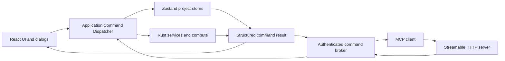

# Issue 188 MCP Application Command Layer Design

**Date:** 2026-09-15
**Status:** Approved
**Issue:** https://github.com/ashton2914/StatsPlayground/issues/188

## Purpose

StatsPlayground must expose most existing project workflows to external AI
clients through a standard Model Context Protocol interface. AI control must
replace the human's mechanical interaction with the application without
creating a second, reduced implementation of application behavior.

The stable interface is the user intent behind a control, not the control
itself. React dialogs and buttons collect input and invoke typed application
commands. MCP tools validate structured input and invoke those same commands.
MCP never queries, selects, or activates DOM elements.

Given equivalent inputs, human and AI entry points must create behaviorally
equivalent project content through the same constructors, validation, state
mutations, statistical services, dirty/history handling, and serializers.

## Product Scope

Phase 1 controls one already-open StatsPlayground application and project. The
MCP server is part of the running Tauri process; it is not a daemon and does
not launch or discover another application instance.

Phase 1 exposes:

- Project inspection.
- Table listing and description, including bounded data preview.
- Project document listing and retrieval.
- Table creation with complete column display and additional properties.
- Table Transform creation and execution.
- Tabulate creation, execution, and conversion to Table.
- One safe read-only SQL query whose result becomes a managed Table.
- Graph Builder creation and update.
- Analysis creation, update, and execution for every registered Analysis kind.
- Report creation and update.
- Table export to CSV.
- Save to the current project path.
- Snapshot creation.
- An AI menu, an AI activity view, MCP server management, and a truthful Skills
  placeholder.

Phase 1 does not expose:

- Project launch, discovery, open, or close.
- Save As to an arbitrary path.
- Arbitrary file import.
- Project object deletion.
- Snapshot restore.
- Persisted SQL Query documents.
- MCP Resources, Prompts, Sampling, or Tasks.
- A Skills runtime, installation protocol, or plugin format.
- DOM automation or UI event simulation.

## Current Architecture And Problem

Rust/Tauri owns DuckDB, project metadata, archive services, statistical
execution, and workflow journaling. React/Zustand owns most Graph Builder,
Analysis, Tabulate, Report, folder, dirty/history, and active-document state.
`Workspace.tsx` still orchestrates many user-facing operations directly.

Wrapping only existing Rust commands would bypass frontend-owned project
documents and lifecycle state. Driving menu items or controls would couple MCP
to mutable component structure and fail whenever the UI is reorganized.

The Workflow subsystem provides a useful execution and commit-packet pattern,
but MCP is not itself a Workflow. Save, Snapshot, export, and interactive
document creation are application commands even when no Workflow operation
exists for them.

## Architectural Decision

Introduce a UI-independent typed Application Command Layer and place an MCP
adapter beside the UI adapter.



### Command boundary

Extract every user intent that changes project state, performs a calculation,
or produces an output. Do not extract presentation-only interactions such as:

- Opening or closing a menu or dialog.
- Hover, focus, drag highlight, and context-menu position.
- Activity view selection and transient panel collapse.
- Toasts, loading overlays, and local input editing state.

A dialog-backed operation begins at its confirmed, resolved input. For example,
`analysis.create` accepts the complete typed definition; it does not open the
Analysis dialog. Command names describe stable domain intent, never a control,
component, or click.

The command family is a discriminated union with matching typed results:

```ts
type ApplicationCommand =
  | { type: "project.inspect"; input: ProjectInspectInput }
  | { type: "table.create"; input: CreateTableInput }
  | { type: "analysis.create"; input: CreateAnalysisInput }
  | { type: "analysis.run"; input: RunAnalysisInput }
  | { type: "project.save"; input: SaveProjectInput };

interface CommandResult<T> {
  requestId: string;
  command: ApplicationCommand["type"];
  changed: boolean;
  projectRevision: number;
  data: T;
  warnings: CommandWarning[];
}
```

The implementation must use exhaustive dispatch. Unknown command variants are
compile-time or schema errors, not silent no-ops.

### Shared behavior ownership

Each application command owns the complete user intent:

- Input validation and canonical name resolution.
- Calls to Rust services and statistical execution.
- Canonical document construction.
- Zustand project mutations.
- Dirty, history, active-document, and revision updates.
- Structured success, warning, and error results.

UI handlers become thin adapters that collect input, invoke a command, and
render its outcome. MCP handlers convert validated MCP parameters into the same
command. Neither adapter may duplicate defaults, validators, constructors, or
commit behavior.

## Human And AI Artifact Equivalence

MCP must not create a reduced or MCP-specific document. For equivalent inputs,
the UI and MCP paths enter the same application command and produce equivalent:

- Domain object definitions and default values.
- DuckDB tables and metadata.
- Project folder and document references where the command defines them.
- Dirty, history, generation, and project revision changes.
- Analysis configuration revisions and stale fences.
- Archive entries and export content.
- Reopened editing and execution behavior.

Equivalence is based on normalized business structure and behavior, not
byte-identical archives. UUIDs, timestamps, elapsed times, and other legitimate
nondeterministic audit fields may differ.

MCP origin is retained only in the current server session's audit log. Project
documents, `.spprj` archives, `.sptb` files, and exports contain no AI-origin
marker. A reopened artifact must not have reduced UI capabilities based on its
entry point.

MCP implementations are forbidden from:

- Constructing `.spprj`, `.sptb`, `.spgh`, `.span`, or `.sprp` content directly.
- Mutating Zustand item arrays outside the command layer.
- Bypassing canonical document constructors.
- Defining MCP-only defaults, validators, or document schemas.
- Bypassing dirty/history, dataset generation, or Analysis stale fences.

## Table And Column Contract

Table creation is not limited to DuckDB column names and SQL types. The public
column input includes the complete display contract:

```ts
interface CreateTableColumn {
  name: string;
  sqlType: string;
  display?: {
    width?: number;
    format?: {
      kind: string;
      decimals?: number;
      currency?: string;
    };
    extras?: Record<string, unknown>;
  };
}
```

`extras` remains an open-ended, registry-owned property bag. It supports
current kinds such as `unit`, `spec`, `range`, and `notes`, and future registered
kinds without changing the MCP transport. The backend continues to preserve
these values as opaque JSON while the frontend registry owns their semantics.

Missing display input uses the same default resolver as manual creation.
`table.describe` returns names, types, widths, formats, and extras so a read and
subsequent update cannot silently discard metadata.

`table.create` is one atomic application command:

1. Validate names, SQL types, values, formats, and registered extras.
2. Create the managed DuckDB Table and metadata.
3. Persist the complete `columnDisplay` mapping.
4. Refresh dataset metadata and generation.
5. Update selection, dirty state, history, and project revision.
6. Publish success only after the complete intent commits.

A failure must leave neither a partial Table nor orphaned display metadata.
SQL-to-Table and Tabulate-to-Table use this same canonical Table commit path.

## MCP Transport And Lifecycle

Use the official Rust `rmcp` SDK with Streamable HTTP mounted in the Tauri
process. The server advertises the `tools` capability and typed JSON Schema
2020-12 inputs and outputs.

Lifecycle rules:

- MCP is stopped by default on every application start.
- Only an explicit in-app action starts it.
- Bind only to `127.0.0.1` on an operating-system-assigned port.
- Generate a new high-entropy bearer token for each start.
- Stop invalidates the token, closes clients, and cancels requests that have
  not entered commit.
- Application shutdown stops the server before project state is torn down.
- A fresh application process never inherits a prior endpoint or token.

The UI exposes the endpoint and copyable client configuration. The token is
masked by default. It is never stored in a project, persisted as a preference,
logged, or included in an error.

## Rust-To-Frontend Command Broker

The Rust server cannot execute frontend-owned document operations directly.
An authenticated broker correlates an MCP call with the registered frontend
dispatcher:

1. Validate HTTP security, MCP envelope, tool schema, and server lifecycle.
2. Allocate a `requestId` and enqueue the application command.
3. Emit the command to the ready frontend dispatcher.
4. Await the correlated structured result.
5. Convert the result into MCP structured content and compatible text content.

If no dispatcher is registered, no project is open, the project is read-only,
or the app is closing, the call returns a specific tool execution error without
partial work.

The bridge must have bounded pending-request capacity. Late frontend responses
for an expired or cancelled request are ignored unless that request already
entered the non-interruptible commit phase; in that case the broker returns or
records the final committed outcome rather than claiming rollback.

## Command Scheduling And Consistency

All project mutations from UI and MCP enter one FIFO mutation queue. This
prevents concurrent writes to DuckDB and frontend project documents from
overwriting each other. Read-only inspect commands may run concurrently only
against an internally consistent snapshot.

Every successful project mutation increments `projectRevision`. Mutation tools
accept:

```ts
interface MutationControl {
  expectedProjectRevision?: number;
  idempotencyKey?: string;
}
```

- Updates to existing objects should carry the last inspected revision.
- A mismatched revision returns `revision_conflict` before mutation.
- Creates may omit the revision but still use the mutation queue.
- A session-scoped duplicate idempotency key returns the original result.
- Clients must not blindly retry a timed-out mutation without an idempotency
  key.

Graph, Analysis, Tabulate, and Report updates also validate the target document
revision or equivalent current definition, so stale AI state cannot replace a
newer human edit.

## Atomic Command Execution

The conceptual command lifecycle is:

```text
validate -> stage/compute -> commit Rust state -> commit frontend documents
         -> dirty/history/revision -> structured result
```

Operations stage all work that can fail before publishing project state.
Cross-layer operations either define compensation or arrange failure-prone
work before commit. The final commit segment is short and non-interruptible.

Workflow validators and executors may be reused where they already express the
same behavior. MCP must not introduce a parallel statistical implementation or
force non-Workflow commands into Workflow semantics.

## Phase 1 MCP Tool Catalog

Tool names use the stable `statsplayground.<domain>.<action>` namespace.

### Project and discovery

| MCP tool | Application command | Result |
| --- | --- | --- |
| `statsplayground_project_inspect` | `project.inspect` | Project metadata, dirty/read-only state, revision, object summaries, and capabilities. |
| `statsplayground_table_list` | `table.list` | Paginated stable IDs, names, and row/column counts. |
| `statsplayground_table_describe` | `table.describe` | Schema, complete display/extras properties, generation, and optional bounded preview. |
| `statsplayground_document_list` | `document.list` | Paginated Transform, Tabulate, Graph, Analysis, and Report summaries. |
| `statsplayground_document_get` | `document.get` | Full current document definition and execution state by stable ID. |

Preview is opt-in and row-limited. No inspect tool returns an entire unbounded
Table or an absolute filesystem path.

### Table and SQL

| MCP tool | Application command | Result |
| --- | --- | --- |
| `statsplayground_table_create` | `table.create` | Managed Table ID, final name, generation, schema, and complete column properties. |
| `statsplayground_table_transform_create` | `tableTransform.create` | Persistent Transform definition and ID. |
| `statsplayground_table_transform_run` | `tableTransform.run` | Updated target Table and execution summary. |
| `statsplayground_sql_create_table` | `sql.createTable` | New managed Table created from the complete query result. |
| `statsplayground_table_export_csv` | `table.exportCsv` | Authorized root alias, relative path, and export summary. |

`sql.createTable` does not create a persisted SQL document. It reuses the
existing SQL Query product behavior: execute one read-only query and explicitly
create a managed result Table.

### Tabulate, Graph, Analysis, and Report

| MCP tool | Application command | Result |
| --- | --- | --- |
| `statsplayground_tabulate_create` | `tabulate.create` | Canonical Tabulate document and ID. |
| `statsplayground_tabulate_run` | `tabulate.run` | Persisted latest execution state and summary. |
| `statsplayground_tabulate_to_table` | `tabulate.exportTable` | Canonical managed Table from a current or refreshed result. |
| `statsplayground_graph_create` | `graph.create` | Canonical Graph Builder document and ID. |
| `statsplayground_graph_update` | `graph.update` | Validated updated Graph definition. |
| `statsplayground_analysis_create` | `analysis.create` | Canonical registered Analysis document and ID. |
| `statsplayground_analysis_update` | `analysis.update` | Validated definition or presentation update. |
| `statsplayground_analysis_run` | `analysis.run` | Current result summary under the full Analysis stale fence. |
| `statsplayground_report_create` | `report.create` | Canonical Report document and ID. |
| `statsplayground_report_update` | `report.update` | Updated Markdown and validated project references. |

Analysis uses one tool family with a registry-constrained `kind`; it does not
add a transport-level tool for every statistical method. The input schema or
discoverable manifest must reject unknown kinds and preserve the complete
kind-specific definition.

### Project lifecycle

| MCP tool | Application command | Result |
| --- | --- | --- |
| `statsplayground_project_save` | `project.save` | Saved project identity and revision without absolute path disclosure. |
| `statsplayground_snapshot_create` | `snapshot.create` | Snapshot ID, name, timestamp, and project revision. |

`project.save` saves only to the current project destination. A project without
a writable current path returns `project_path_required`; MCP cannot turn that
call into Save As.

## Structured Results And Errors

Every successful tool returns structured content conforming to its output
schema and a JSON text block for compatibility. Creates return stable IDs and
final resolved names. Execution tools return status, summaries, warnings, and
related object IDs. File tools return only an authorized root alias and a
relative path.

Business failures use MCP tool execution errors (`isError: true`) so a model can
correct inputs. Protocol errors are reserved for an unknown tool, malformed MCP
envelope, or input that cannot satisfy the tool schema.

```ts
interface CommandError {
  requestId: string;
  code:
    | "app_not_ready"
    | "project_required"
    | "project_path_required"
    | "read_only"
    | "invalid_input"
    | "not_found"
    | "revision_conflict"
    | "path_not_authorized"
    | "confirmation_required"
    | "user_denied"
    | "queue_full"
    | "timeout"
    | "cancelled"
    | "execution_failed";
  message: string;
  retryable: boolean;
  details?: Record<string, unknown>;
}
```

Error details identify the affected domain object and corrective constraint
without exposing SQL internals, tokens, or absolute paths.

## Confirmation Policy

Authentication authorizes access to the exposed Phase 1 tool surface, but it
does not grant an argument-level confirmation bypass.

- Ordinary create, configure, inspect, and run commands execute directly.
- File overwrite, deletion when introduced later, closing an unsaved project,
  and similarly destructive actions require in-app confirmation.
- The command policy registry, not individual MCP handlers, assigns risk.
- Request input can never contain a trusted `confirmed` or equivalent flag.
- Awaiting confirmation keeps the call pending and visible in the AI view.
- Allow resumes the same request; Deny returns `user_denied` with no mutation.

Phase 1 has no deletion or close tool, but the policy boundary is established
now so later tools cannot bypass it.

## HTTP And Local Service Security

The Streamable HTTP layer must:

- Validate bearer authentication for initialization and every subsequent
  request.
- Validate `Origin` on every incoming connection. An invalid present Origin
  returns HTTP 403. Missing Origin remains valid for native MCP clients.
- Avoid broad CORS configuration.
- Bind only to IPv4 loopback, never `0.0.0.0` or an IPv6 wildcard.
- Limit request body size, concurrent requests, queue depth, and request rate.
- Sanitize tool outputs and audit fields.
- Negotiate supported MCP protocol versions through `rmcp`.
- Use a single Streamable HTTP endpoint.

The first implementation should target the stable protocol supported by the
pinned `rmcp` release and retain compatibility with `2025-11-25`. Newer draft
features are not prerequisites for Phase 1.

## File Authorization

Export commands accept only:

```ts
interface AuthorizedOutputPath {
  rootId: string;
  relativePath: string;
}
```

`rootId` identifies a directory explicitly authorized in the application UI.
The Rust path service:

- Rejects absolute paths and parent traversal.
- Validates names before filesystem access.
- Resolves existing symlinks and verifies the final target remains below the
  authorized root.
- Uses a safe parent-resolution strategy for a new target file.
- Requires in-app confirmation before overwriting an existing file.
- Never returns the root's absolute path to the frontend or MCP client.
- Delegates encoding and writing to the existing exporter.

Authorization grants are runtime application state. They are not embedded in a
project archive and do not silently transfer to another machine.

## SQL Safety

`statsplayground_sql_create_table` accepts exactly one query that produces a
result set. It reuses the existing AST allowlist and database hardening rather
than keyword checks.

The command allows a read-only `SELECT` or CTE-backed query over managed project
Tables. It rejects:

- Multiple statements.
- DDL and DML.
- `COPY`, `ATTACH`, `PRAGMA`, `INSTALL`, and `LOAD`.
- External file readers, table functions, and external schemas.
- References outside current project Table aliases and in-scope CTEs.

Execution has bounded time and result constraints. The complete validated query
is rerun for Table creation rather than trusting preview rows. The resulting
Table enters the canonical Table commit path and receives complete column
display defaults.

## Long Operations, Progress, And Cancellation

Phase 1 tool calls wait for command completion. This is more interoperable than
requiring operation IDs or the MCP Tasks extension.

- Queued requests can be cancelled immediately.
- Running services use cooperative cancellation where supported.
- Progress is reported when the negotiated client transport supports it and is
  always reflected in the AI management view.
- Each command class has an explicit timeout.
- Timeout does not imply rollback after commit begins.
- The final commit segment completes atomically once entered.
- Clients use idempotency keys to resolve uncertain timeout outcomes.
- Stopping MCP cancels every request that has not entered commit.

## AI Management Interface

Add a top-level `AI` menu with:

- `MCP Server...`
- `Skills...`

Add an AI activity icon and management view. The MCP Server surface includes:

- Stopped, starting, running, and stopping states.
- Start and Stop controls.
- Loopback endpoint and actual random port.
- Masked token with an explicit copy action.
- Copyable standard MCP client configuration.
- Authorized output-root management.
- Current connection count and queued/running requests.
- Recent session audit entries.
- Allow/Deny controls for pending high-risk actions.

Stopping clears the token, active connections, pending confirmations, and
session audit log.

The Skills surface is a labeled placeholder with an empty state and future
direction. It must not advertise unavailable MCP tools or imply that Skills can
be installed, enabled, or executed in Phase 1.

## Session Audit Model

The AI view keeps a bounded in-memory log:

```ts
interface McpAuditEntry {
  requestId: string;
  timestamp: string;
  clientId?: string;
  tool: string;
  status:
    | "queued"
    | "running"
    | "awaiting-confirmation"
    | "succeeded"
    | "failed"
    | "cancelled";
  durationMs?: number;
  errorCode?: string;
}
```

Audit entries exclude bearer tokens, complete Table content, SQL result rows,
and absolute paths. They are not saved into the project or restored on the next
application start.

## Testing Strategy

### Application command contracts

Each command has focused tests for:

- Input and name validation.
- Canonical default resolution.
- Dirty, history, active selection, generation, and revision changes.
- Read-only and stale-revision rejection.
- Idempotency behavior.
- No partial state after failure.
- UI adapter and MCP adapter projection to the same command.

### Table equivalence

Create equivalent Tables through the manual UI adapter and MCP adapter, save
both projects, reopen them, and compare normalized structure and behavior.
Coverage includes:

- Data values, nulls, and SQL types.
- Width.
- Format kind, decimals, and currency.
- Registered `unit`, `spec`, `range`, and `notes` extras.
- Unknown but valid opaque extras.
- Continued UI editing, analysis use, save, and export.

### Document equivalence

For Table Transform, Tabulate, Graph, each registered Analysis kind, and Report:

1. Build one document through the manual adapter.
2. Build an equivalent document through the MCP adapter.
3. Normalize UUID and timestamp fields.
4. Compare persisted structures after save and reopen.
5. Execute or render both and compare typed business results.
6. Confirm both remain editable, runnable, savable, and exportable in the UI.

These black-box contracts prevent future MCP-only document formats.

### Rust MCP and security

Rust tests cover:

- Initialize, protocol negotiation, `tools/list`, and `tools/call`.
- Input and output schema conformance.
- Bearer token and Origin rejection.
- Loopback-only binding.
- Request body, concurrency, rate, and queue limits.
- Dispatcher-not-ready, timeout, cancellation, and shutdown.
- Tool execution errors versus JSON-RPC errors.
- Relative path validation, traversal, and symlink escape.
- SQL AST and external-access restrictions.

### End-to-end coverage

An integration harness exercises:

```text
MCP client -> Streamable HTTP -> Rust broker -> frontend dispatcher
           -> Rust/Zustand mutation -> save -> reopen -> inspect
```

It covers at least Table with extras, SQL-to-Table, Table Transform, Tabulate,
Tabulate-to-Table, Graph, one Analysis kind, Report, CSV export, project save,
and Snapshot creation.

## Acceptance Criteria

Issue 188 Phase 1 is complete only when:

- MCP never queries or operates the DOM.
- UI and MCP invoke the same application commands.
- AI-created content reopens as behaviorally equivalent human-created content.
- Table creation and inspection preserve all column display and extra
  properties.
- Every exposed manual entry point has migrated to the shared command path.
- Reorganizing menus, controls, or component structure does not fail MCP tests.
- No MCP-only project format, default resolver, validator, or statistical
  implementation exists.
- Service startup is explicit and default-off; every start rotates the token.
- The server is loopback-only and validates authentication and Origin.
- File access cannot leave an authorized root or disclose an absolute path.
- High-risk confirmation cannot be bypassed through request arguments.
- Long requests produce deterministic completion, cancellation, and timeout
  outcomes.
- Frontend tests/build, Rust format/build/clippy/test, MCP integration tests,
  and archive save/reopen parity tests pass.

## Delivery Phases

### Phase 0: Design baseline

Commit this approved design independently from implementation.

### Phase 1: Application command foundation

Add command/result/error unions, the command policy registry, mutation queue,
project revision, idempotency handling, and a test dispatcher. Migrate one thin
vertical slice through both UI and a non-HTTP adapter to prove equivalence.

### Phase 2: Read and Table commands

Implement project/table/document inspection, canonical Table creation with
complete display/extras properties, and adapter-equivalence save/reopen tests.

### Phase 3: Document command migration

Move Table Transform, Tabulate, Graph, Analysis, Report, save, Snapshot, SQL
result creation, and CSV export from component orchestration into shared
commands. Preserve existing constructors, Rust services, workflow executors,
and Analysis contracts.

### Phase 4: Rust broker and MCP transport

Add the pinned official `rmcp` dependency, Streamable HTTP lifecycle, bearer and
Origin middleware, typed tools, bounded broker, cancellation, error mapping,
and security tests.

### Phase 5: AI management UI

Add the AI menu and activity surface, server controls, token/config copy,
authorized roots, session audit, pending confirmations, and Skills placeholder.

### Phase 6: End-to-end parity and hardening

Complete cross-layer MCP tests, all artifact-equivalence cases, security abuse
cases, performance limits, desktop manual acceptance, and documentation for
connecting common MCP clients.

Each phase must preserve a building application and have focused executable
tests. The implementation plan may split phases further, but it must not merge
the shared command migration and external transport into one unreviewable
change.

## Risks And Mitigations

### Cross-layer atomicity

Rust and Zustand do not share a database transaction. Stage failure-prone work,
keep commit segments small, define compensation where unavoidable, and test
every cross-layer failure boundary.

### Large `Workspace.tsx` extraction

Move one complete user intent at a time. Keep dialogs as adapters and validate
each migration through existing UI tests plus command contracts. Avoid a broad
component rewrite unrelated to MCP.

### Schema breadth

Graph and Analysis definitions are rich discriminated unions. Reuse their
canonical contracts and registries rather than inventing generic maps. Reject
unsupported kinds explicitly.

### External-client compatibility

Start with tools and synchronous Streamable HTTP calls supported broadly by MCP
clients. Do not require Resources or Tasks in Phase 1. Return both structured
content and compatible JSON text.

### Security of a local HTTP server

Treat localhost as untrusted. Require a fresh token, validate Origin, bind only
to loopback, limit resources, constrain SQL and paths, and keep destructive
approval in the application.

## Open Questions Deferred From Phase 1

The following require separate design before exposure:

- Opening and closing projects through MCP.
- Save As and persistent directory grants.
- Import and destructive document operations.
- Snapshot restore and history navigation.
- MCP Resources or subscriptions for live project updates.
- MCP Tasks for durable long-running operations.
- A real Skills installation and execution model.

None of these deferred capabilities may be inferred from the Phase 1 token or
implemented as an undocumented command.